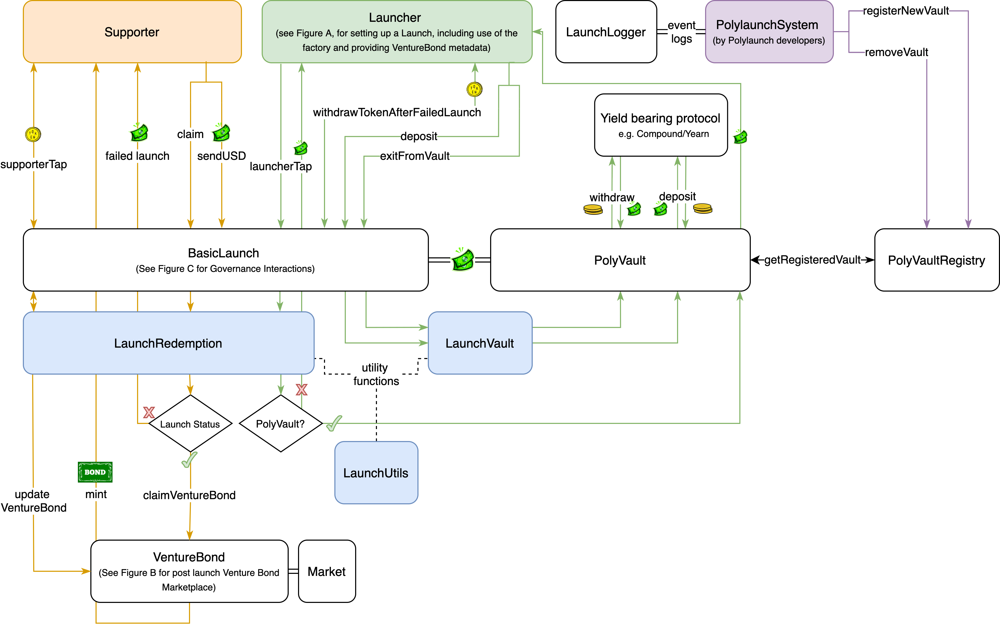
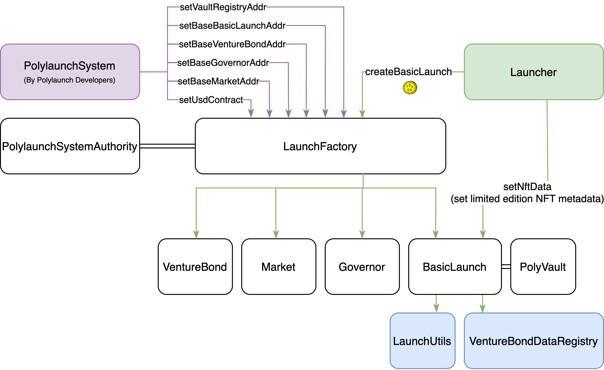
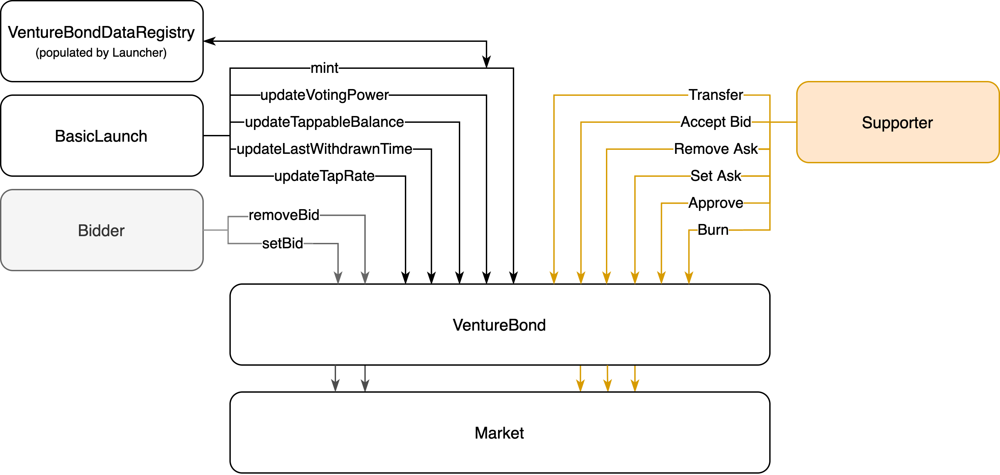
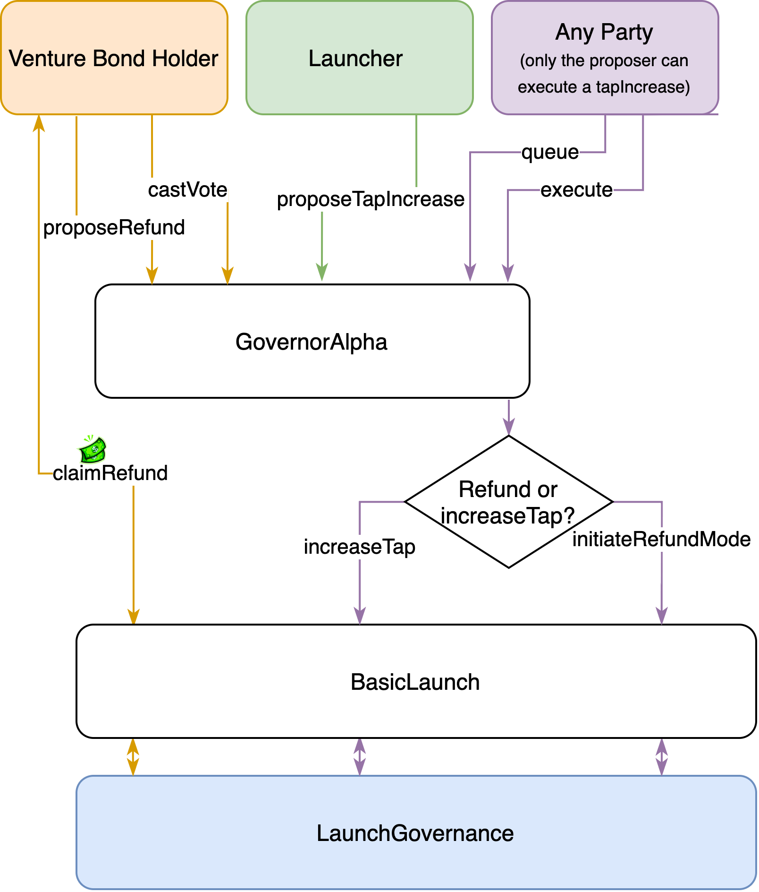

# Polylaunch Protocol

Important note: this branch uses an old NFT implementation and may not be up to date.

This repo uses brownie, to run the tests carry out all the necessary brownie setup.

To run the standard tests:

```
$ cd solidity
$ brownie test tests/standard-tests
```
 To run the mainnet tests:
 
Set up an infura id in your environmental variables.

For it to work fast you need your ETHERSCAN_TOKEN api key in your environmental variables

https://eth-brownie.readthedocs.io/en/stable/network-management.html#using-infura 
```
$ cd solidity
$ brownie test tests/mainnet-fork-tests --network mainnet-fork -s
```

## Polylaunch Protocol Flowcharts

Overall Polylaunch Protocol - 5th April 2021




Figure A - Prelaunch interactions - 5th April 2021




Figure B - Venture Bond and Market interactions - 5th April 2021




Figure C - Polylaunch Governance - 5th April 2021



